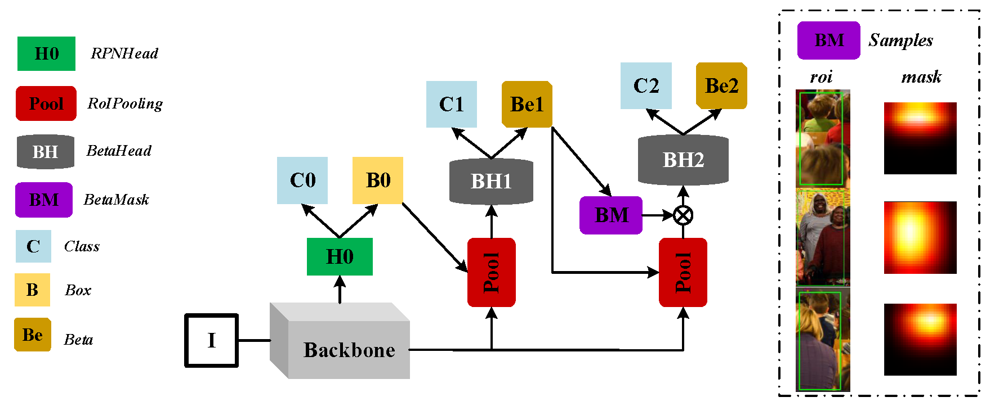
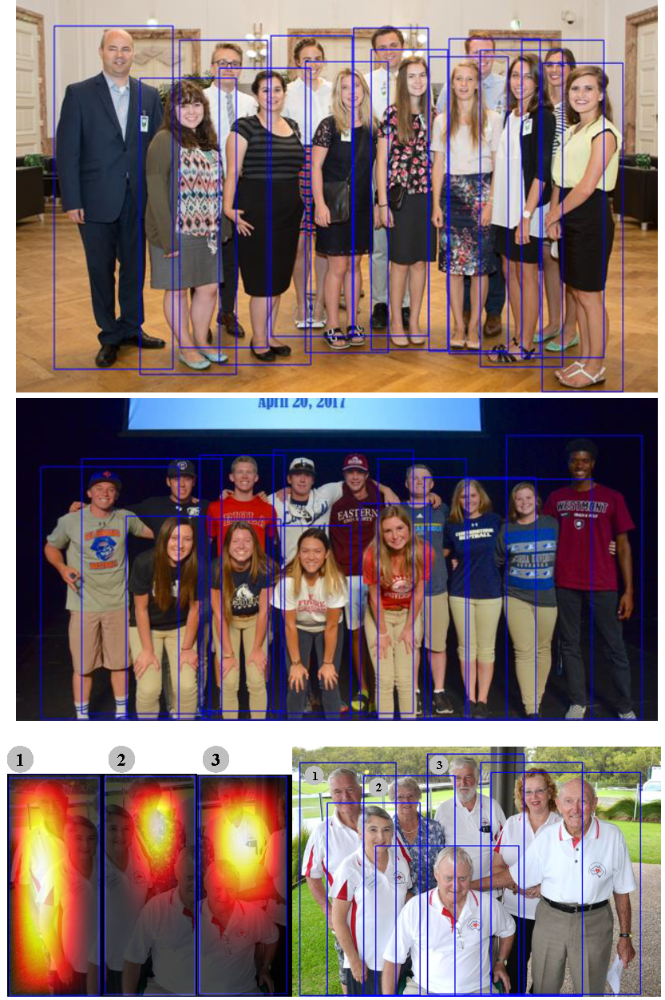

# Beta R-CNN: Looking into Pedestrian Detection from Another Perspective

This is the pytorch implementation of our paper "[Beta R-CNN: Looking into Pedestrian Detection from Another Perspective]", published in Neurips 2020.

Our method aiming at detecting highly occluded and highly-overlapped instances in crowded scenes especially for pedestrian detection.

Codes are prepared to release here. Due to the experiments are conducted with internal framework, we need some time to rewrite and clean the code. We will release the complete code soon.

# Abstract

Recently significant progress has been made in pedestrian detection, but it remains challenging to achieve high performance in occluded and crowded scenes. It could be mostly attributed to the widely used representation of pedestrians, i.e.,  2Daxis-aligned bounding box, which just describes the approximate location and size of the object. Bounding box models the object as a uniform distribution within the boundary, making pedestrians indistinguishable in occluded and crowded scenes due to much noise. To eliminate the problem, we propose a novel representation based on 2D beta distribution, named Beta Representation. It pictures a pedestrian by explicitly constructing the relationship between full-body and visible boxes,and emphasizes the center of visual mass by assigning different probability values to  pixels.   As  a  result,  Beta  Representation  is  much  better  for  distinguishing highly-overlapped instances in crowded scenes with a new NMS strategy named BetaNMS. What’s more, to fully exploit Beta Representation, a novel pipeline Beta R-CNN equipped with BetaHead and BetaMask is proposed, leading to high detection performance in occluded and crowded scenes.

# Method

The network structure and some visualization results are shown here:

- 

# Citation

​	 

# Contact

If you have any questions, please do not hesitate to contact Zixuan Xu ([zixuanxu@pku.edu.cn](mailto:zixuanxu@pku.edu.cn)).
